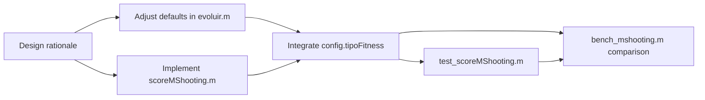

# GOALS — MGGP_Vmatlab Validation & Benchmarking Plan

**Goal of this plan:** prove that the MATLAB port is correct (identifies the right model),
competitive in quality (same or better than the Python original on the same data), and
measurably faster when parallelism is enabled — with numbers, not just "it ran without error."

---

## 0. Prerequisites — get the 8 tests green first

Nothing in this plan is meaningful if the basic tests are failing. Run these first,
fix each layer before moving up.

- [x] Run `test_ls` — exit without error
- [x] Run `test_predictFreeRun` — exit without error
- [x] Run `test_MggpModel` — exit without error
- [x] Run `test_operadoresGeneticos` — exit without error (fix: crossoverTermos roubava do pai em vez do irmão)
- [x] Run `test_evoluir` — exit without error
- [x] Run `test_evoluir_parfor` — exit without error (requires PCT)
- [x] Run `test_lsGpu` — exit without error or expected skip message (no GPU)
- [x] Run `test_evoluirNsga2` — exit without error
- [x] `run_tests.m` exits with code 0 when all pass

---

## 1. Functional validation — does the model identification work?

### 1a. Synthetic SISO system (known ground truth)

Create `dev/benchmarks/bench_siso.m`. ✅

The system: `y(k) = 0.75·y(k-2) + 0.25·u1(k-1) − 0.20·y(k-2)·u1(k-1)`
(same as the test system — it is a known NARX where the true structure and true θ are known)

- [ ] Generate N = 1000 samples with `rng(42)`, PRBS u1 (randn is fine)
- [ ] Split 70 % identification / 30 % validation (never touched during evolution)
- [ ] Run `evoluir` with production-sized config: `popSize=100`, `nGeracoes=50`, `maxDelay=3`,
      `maxFatoresPorTermo=2`, `usarParfor=false`
- [ ] Compute and print:
  - **OSA-RMSE (id)**: `sqrt(scoreOsa(theta, terms, vars_id))` on identification set
  - **OSA-RMSE (val)**: same on validation set (unseen during GP)
  - **Free-run RMSE (val)**: `sqrt(mean((y_val - predictFreeRun(model, theta, vars_val)).^2))`
  - **Model complexity**: `model.numTermos()`, `model.maiorAtraso()`
  - **Structure recovered**: `model.toString()` — does it match `y(k-2)`, `u1(k-1)`, `y(k-2)*u1(k-1)`?
- [ ] Pass threshold: OSA-RMSE (val) < 0.01 (noise floor of the synthetic data) in at least
      3 out of 5 independent seeds (`rng(42..46)`)

### 1b. Residual analysis

Create `dev/benchmarks/bench_residuals.m` (uses output from bench_siso). ✅

- [ ] Compute residuals `e(k) = y_val(k) − ŷ_osa(k)` on validation set
- [ ] Print mean(e) — should be ≈ 0
- [ ] Print `corr(e(2:end), e(1:end-1))` — lag-1 autocorrelation, should be < 0.05 for
      a well-identified model (residuals should be white)
- [ ] Print `corr(e(maxDelay+1:end), u1_val(1:end-maxDelay))` — cross-correlation with
      past input, should be < 0.05 (residuals independent of past inputs)
- [ ] Save results to `dev/benchmarks/results/residuals_siso.json` (use `jsonencode`)

### 1c. MISO system (multiple inputs)

Create `dev/benchmarks/bench_miso.m`. ✅

System: `y(k) = 0.5·y(k-1) + 0.3·u1(k-1) − 0.15·u2(k-1)·y(k-1)`

- [ ] Generate N = 800 samples, two independent inputs u1, u2
- [ ] Same split and metrics as bench_siso
- [ ] Confirm that the recovered model uses `u1` and `u2` field names from the struct
      (validates the MISO path end-to-end)

---

## 2. Comparison with Python original

Create `dev/benchmarks/bench_python_comparison.m` and a companion Python script
`dev/benchmarks/python_baseline.py`.

Goal: run both implementations on the **exact same dataset and hyperparameters**, then
compare quality side-by-side.

### 2a. Shared dataset

- [ ] Generate the SISO dataset with `rng(42)`, N=1000, save as `dev/benchmarks/data/siso_ref.csv`
      (columns: `y`, `u1`) — MATLAB writes it, Python reads it
- [ ] Python baseline script reads `siso_ref.csv`, runs `mggp` with matching params
      (`pop_size=100`, `n_gen=50`, `max_delay=3`), saves best OSA-RMSE and model string to
      `dev/benchmarks/results/python_result.json`

### 2b. Comparison metrics

- [ ] MATLAB bench_python_comparison.m reads `python_result.json` and prints a table:

  | Metric             | MATLAB | Python |
  |--------------------|--------|--------|
  | Best OSA-RMSE (id) |        |        |
  | Best OSA-RMSE (val)|        |        |
  | Free-run RMSE (val)|        |        |
  | Number of terms    |        |        |
  | Best model string  |        |        |

- [ ] **Pass threshold**: MATLAB OSA-RMSE (val) ≤ Python OSA-RMSE (val) × 1.1
      (within 10 % — GP is stochastic; exact match is not expected)

---

## 3. Performance benchmarking — speed and cost

Create `dev/benchmarks/bench_performance.m`. ✅

All timing via `tic`/`toc`. Each configuration runs 3 seeds; report mean ± std.

### 3a. Sequential vs parallel CPU (parfor)

- [ ] Config: `popSize=100`, `nGeracoes=30`, `usarParfor=false` → record `t_seq`
- [ ] Config: same, `usarParfor=true` → record `t_par`
- [ ] Compute and print:
  - **Speedup**: `t_seq / t_par`
  - **Parallel efficiency**: `speedup / numWorkers` (numWorkers = `gcp().NumWorkers`)
  - **Time per generation (seq)**: `t_seq / nGeracoes` ms
  - **Time per generation (par)**: `t_par / nGeracoes` ms
- [ ] Repeat for `popSize ∈ {50, 100, 200}` to see where parfor overhead breaks even

### 3b. Scalability with dataset size

- [ ] Fix: `popSize=50`, `nGeracoes=20`, `usarParfor=false`
- [ ] Vary: `N ∈ {200, 500, 1000, 2000}` samples
- [ ] Record total wall time and time per individual evaluation
- [ ] Expected: roughly linear in N (LS is O(N·p) where p = num regressors)

### 3c. Time breakdown — where does time go?

- [x] Instrument `evoluir.m` with a `config.verbose_timing = true` flag that prints:
  - % of time in `avaliarPopulacao` (fitness / LS — the main cost)
  - % of time in `proximaGeracao` (crossover + mutation + selection)
  - % of time in overhead (elitism sort, historico update)
- [ ] Goal: confirm that `avaliarPopulacao` is ≥ 80 % of total time (validates that parfor
      targets the right bottleneck)

### 3d. GPU benchmark (requires CUDA GPU)

- [ ] Run `bench_ls_vs_gpu.m` (script created ✅): compare `ls` vs `lsGpu` on matrices of increasing size
      (N × p for N ∈ {100, 500, 2000, 5000}, p ∈ {5, 20, 50})
- [ ] Record CPU time, GPU time (including `gpuArray` transfer cost), and net speedup
- [ ] Expected: GPU wins only for large N and/or large p; document the crossover point
- [ ] Print recommendation: at what population × dataset size does GPU integration become
      worth the restructuring cost?

---

## 4. Results reporting infrastructure

### 4a. Results directory

- [x] Create `dev/benchmarks/results/` (gitignored — generated data)
- [x] Add `dev/benchmarks/results/` to `.gitignore`

### 4b. Output format

Each benchmark saves a `<name>_<timestamp>.json` to `dev/benchmarks/results/` using
`jsonencode`. Fields:
- `timestamp` (string, ISO 8601 via `char(datetime('now','Format','yyyy-MM-dd''T''HH:mm:ss'))`)
- `hostname` (string, `char(java.net.InetAddress.getLocalHost().getHostName())`)
- `matlabVersion` (string, `version`)
- `config` (struct of hyperparameters used)
- `metrics` (struct of computed metrics)

- [x] `bench_siso.m` saves `results/siso_<timestamp>.json`
- [x] `bench_performance.m` saves `results/perf_<timestamp>.json`
- [ ] `bench_python_comparison.m` saves `results/comparison_<timestamp>.json` (§2 skipped)

### 4c. Summary printer

Create `dev/benchmarks/print_summary.m`. ✅

- [x] Reads all JSON files in `results/` matching a given prefix
- [x] Prints a markdown-style table to stdout (the same format as §2b)
- [x] Allows comparing runs across sessions (before/after a code change)

---

## 5. NSGA-II validation

Create `dev/benchmarks/bench_nsga2.m`. ✅

NSGA-II trades model accuracy for model simplicity (fewer terms). Validation:

- [ ] Run `evoluirNsga2` on the SISO dataset, `popSize=80`, `nGeracoes=30`
- [ ] Verify that the returned Pareto front is non-dominated:
  for each pair (A, B) in front, neither A dominates B nor B dominates A
- [ ] Plot (or print) the Pareto front: OSA-RMSE vs number of terms
- [ ] Confirm that the minimum-error point on the Pareto front is within 10 % of the
      `evoluir` best (single-objective result) on the same dataset
- [ ] Confirm that the minimum-complexity point has ≤ 2 terms and finite fitness

---

## 6. CI integration

- [x] Add a `ci-benchmarks` job to `.github/workflows/ci.yml` that runs `bench_siso.m`
      with a small config (`popSize=40`, `nGeracoes=10`) as a smoke test
  - Fails the build if OSA-RMSE (val) > 0.5 (sanity gate, not quality gate)
  - Prints the results table as a job summary (`set-output` or `echo >> $GITHUB_STEP_SUMMARY`)
- [x] Full benchmark suite (`bench_performance.m`, `bench_nsga2.m`) runs only
      on workflow_dispatch (manual trigger) to avoid expensive CI on every push

---

## 7. Optional stretch goals

- [ ] Integrate `lsGpu` into `evoluir.m` via a `config.usarGpu` flag — requires
      restructuring `avaliarPopulacao` to process the whole population in one batched LS call
      (see GPU integration decision in CLAUDE.md)
- [ ] Add NARMAX support (moving-average noise terms) — requires extending `makeRegressors`
      to accept lagged residuals as regressors
- [ ] Hyperparameter sensitivity analysis: sweep `cxpb`, `mtpb`, `tamanhoTorneio` and
      plot how final fitness varies — useful for setting production defaults

---

## Execution order

```
0 → 1a → 1b → 1c → 3a → 3b → 3c → 4a → 4b → 4c → 2a → 2b → 3d → 5 → 6 → 7
```

Steps 3d and 5 depend on optional hardware (GPU) and extended toolchain (Python + mggp);
they can be skipped without breaking the rest of the plan.

---

# GOALS 2 — Python Alignment

**Goal of this plan:** close the most impactful training-regime gaps between the MATLAB port
and the Python original (`mggp_novo`), without rebuilding anything that already works.
Two targeted changes:

1. **Default hyperparameters** — `numTermosInicial` and `maxDelay` defaults currently don't
   reflect Python's operational range, making out-of-the-box results harder to compare.
2. **MShooting fitness** — the Python default fitness is `MShooting` (windowed free-run),
   not OSA. OSA is numerically safer during GP search but MShooting penalises unstable models
   and tends to generalise better; having it as an option brings the two regimes to parity.



---

## G2-0. Design rationale — read before implementing

**`numTermosInicial` 3 → 5.**
Python default `nTerms=15` counts full GP trees, each potentially 15 levels deep.
MATLAB terms are flat products of `q<k>(<var>)` factors — shallower per term, so fewer
total terms are needed to cover comparable expressiveness. 5 is the correct analogue for
most NARX problems (3 was chosen conservatively when no real MATLAB runs existed yet).

**`maxDelay` required → optional, default 5.**
Python default `nDelays=15` means delays q1…q15 are available as primitives. MATLAB
`maxDelay` currently has no default (required field). A default of 5 covers the vast
majority of benchmark systems (the SISO system in §1a only needs maxDelay=2; 5 gives
headroom for real data). Systems with longer dynamics pass `maxDelay` explicitly.

**MShooting window `k = 5` default.**
Matches the Python default `k=5`. The window divides the validation series into
non-overlapping blocks of k steps; each block is simulated via free-run from real y
initial conditions, then compared to the real output. This penalises models that
diverge after a few steps, unlike OSA which resets from real data every step.

**Out of scope for this feature:**
- Making MATLAB terms hierarchically nestable (deep GP trees) — that would be a rewrite.
- MIMO support — separate feature.
- Matching Python's CrossLowUniform (sub-tree crossover) — no tree structure in MATLAB.
- Replacing OSA as default — MShooting is an *additive option*, OSA stays default.

---

## G2-1. Adjust defaults in `evoluir.m`

- [x] Move `maxDelay` out of `camposObrigatorios` and into `defaults` with value `5`
  - `aplicarDefaults`: add `'maxDelay', 5` to the `defaults` struct
  - Remove `'maxDelay'` from the `camposObrigatorios` cell array
  - Verify: callers that already pass `maxDelay` explicitly are unaffected; callers that
    omit it now get 5 instead of an error — check all benchmark scripts
- [x] Change `numTermosInicial` default from `3` to `5` in `aplicarDefaults`
- [x] Update `CLAUDE.md` "Paralelismo" status note to reflect new defaults

---

## G2-2. Implement `src/scoreMShooting.m`

- [x] Create `src/scoreMShooting.m` with signature:
  ```matlab
  mse = scoreMShooting(theta, terms, vars, maxDelay, k)
  ```
  - `k` (default 5 if omitted): window size in samples
  - Algorithm:
    1. From `vars`, extract `y` and all input fields
    2. Compute `lagMax` from `terms` (same logic as `scoreOsa`)
    3. Divide the valid region `y(lagMax+1 : end)` into non-overlapping windows of `k`
       (drop the last incomplete window)
    4. For each window `w` starting at index `winStart`:
       - `y0 = y(winStart-lagMax : winStart-1)` — real initial conditions
       - `winInputs.(name) = vars.(name)(winStart : winStart+k-1)` for each input
       - Call `predictFreeRun(theta, terms, y0, winInputs)` → `yFull`
       - Predicted values = `yFull(end-k+1 : end)`
       - True values = `y(winStart : winStart+k-1)`
    5. MSE over all windows concatenated
  - Input history at window start: `predictFreeRun` prepends zeros for inputs, which is a
    first-order approximation acceptable for short delays (same behaviour as Python's
    `np.roll`-based implementation)
  - Return `Inf` if `numWindows < 1` (series too short for even one window)
- [x] Mirrors `scoreOsa.m` in style — same header format, same `nargin` guard for optional args

---

## G2-3. Integrate `config.tipoFitness` into `evoluir.m`

- [x] Add `'tipoFitness', 'osa'` to the `defaults` struct in `aplicarDefaults`
- [x] Add `'janelaMShooting', 5` to `defaults` (used only when `tipoFitness='mShooting'`)
- [x] In `avaliarIndividuo`: replace the direct `avaliarFitness` call with a dispatcher
- [x] `avaliarIndividuo` receives `config` as third argument; both call sites updated
- [x] `parfor`-safe: `config` is a struct with no shared mutable state

---

## G2-4. Tests — `dev/tests/test_scoreMShooting.m`

- [x] Create `dev/tests/test_scoreMShooting.m` with function `test_scoreMShooting()`
- [x] Test 1 — finite result on a known model (SISO reference system)
- [x] Test 2 — MShooting >= OSA/2 (MShooting is more demanding, sanity check)
- [x] Test 3 — k > N returns Inf (no complete window possible)
- [x] Add `dev/tests/test_scoreMShooting` to `run_tests.m` as test 9/9

---

## G2-5. Benchmark — `dev/benchmarks/bench_mshooting.m`

- [x] Create `dev/benchmarks/bench_mshooting.m`
- [x] Uses SISO reference dataset, 3 seeds (42–44), popSize=60, nGeracoes=20
- [x] Runs evolution with `tipoFitness='osa'` and `tipoFitness='mShooting'`, same seeds
- [x] Prints OSA-RMSE(val), FR-RMSE(val), wall time; saves JSON via `salvarBenchJson`
- [ ] (manual) Run `bench_mshooting` in MATLAB and verify FR-RMSE(mShooting) ≤ FR-RMSE(osa)×1.5

---

## G2 Execution order

```
G2-0 (design) → G2-1 (defaults) → G2-2 (scoreMShooting) → G2-3 (integrate)
→ G2-4 (tests) → G2-5 (benchmark)
```

G2-1 and G2-2 are independent and can be done in parallel. G2-3 depends on both.
