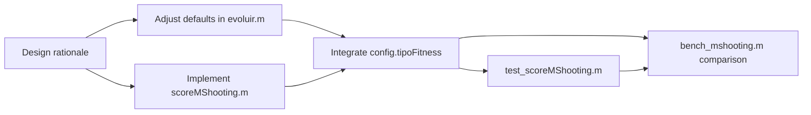
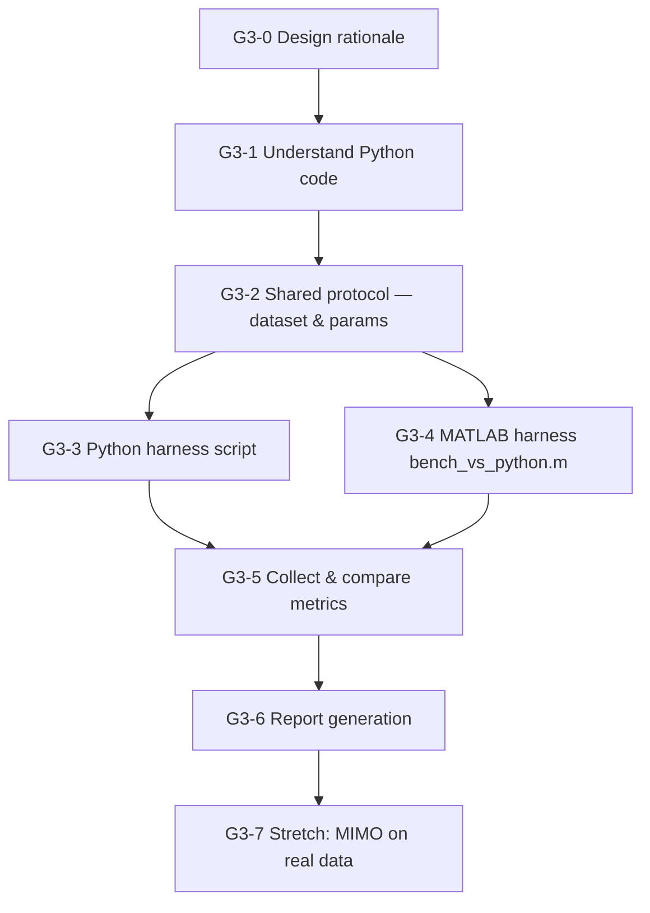
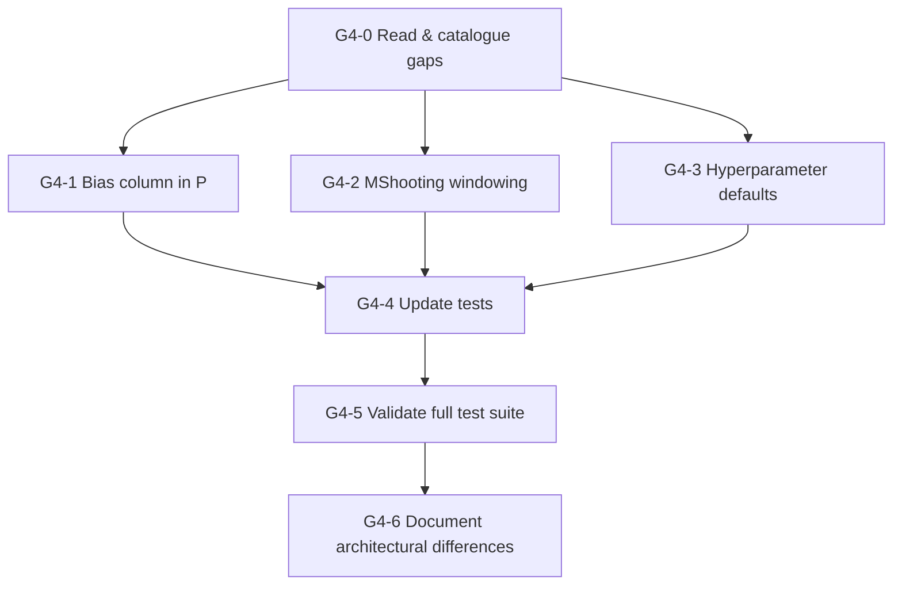
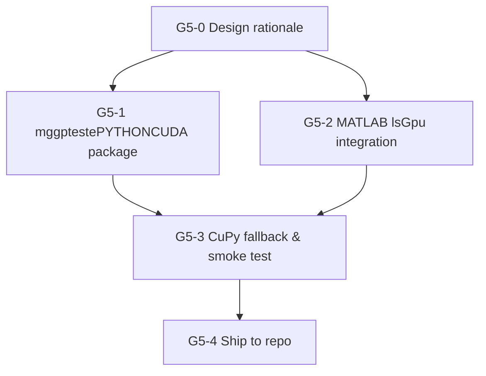

# GOALS — MGGP_Vmatlab Validation & Benchmarking Plan

**Goal of this plan:** prove that the MATLAB port is correct (identifies the right model),
competitive in quality (same or better than the Python original on the same data), and
measurably faster when parallelism is enabled — with numbers, not just "it ran without error."

---

## 0. Prerequisites — get the 8 tests green first

Nothing in this plan is meaningful if the basic tests are failing. Run these first,
fix each layer before moving up.

- [x] Run `test_ls` — exit without error
- [x] Run `test_predictFreeRun` — exit without error
- [x] Run `test_MggpModel` — exit without error
- [x] Run `test_operadoresGeneticos` — exit without error (fix: crossoverTermos roubava do pai em vez do irmão)
- [x] Run `test_evoluir` — exit without error
- [x] Run `test_evoluir_parfor` — exit without error (requires PCT)
- [x] Run `test_lsGpu` — exit without error or expected skip message (no GPU)
- [x] Run `test_evoluirNsga2` — exit without error
- [x] `run_tests.m` exits with code 0 when all pass

---

## 1. Functional validation — does the model identification work?

### 1a. Synthetic SISO system (known ground truth)

Create `dev/benchmarks/bench_siso.m`. ✅

The system: `y(k) = 0.75·y(k-2) + 0.25·u1(k-1) − 0.20·y(k-2)·u1(k-1)`
(same as the test system — it is a known NARX where the true structure and true θ are known)

- [ ] Generate N = 1000 samples with `rng(42)`, PRBS u1 (randn is fine)
- [ ] Split 70 % identification / 30 % validation (never touched during evolution)
- [ ] Run `evoluir` with production-sized config: `popSize=100`, `nGeracoes=50`, `maxDelay=3`,
      `maxFatoresPorTermo=2`, `usarParfor=false`
- [ ] Compute and print:
  - **OSA-RMSE (id)**: `sqrt(scoreOsa(theta, terms, vars_id))` on identification set
  - **OSA-RMSE (val)**: same on validation set (unseen during GP)
  - **Free-run RMSE (val)**: `sqrt(mean((y_val - predictFreeRun(model, theta, vars_val)).^2))`
  - **Model complexity**: `model.numTermos()`, `model.maiorAtraso()`
  - **Structure recovered**: `model.toString()` — does it match `y(k-2)`, `u1(k-1)`, `y(k-2)*u1(k-1)`?
- [ ] Pass threshold: OSA-RMSE (val) < 0.01 (noise floor of the synthetic data) in at least
      3 out of 5 independent seeds (`rng(42..46)`)

### 1b. Residual analysis

Create `dev/benchmarks/bench_residuals.m` (uses output from bench_siso). ✅

- [ ] Compute residuals `e(k) = y_val(k) − ŷ_osa(k)` on validation set
- [ ] Print mean(e) — should be ≈ 0
- [ ] Print `corr(e(2:end), e(1:end-1))` — lag-1 autocorrelation, should be < 0.05 for
      a well-identified model (residuals should be white)
- [ ] Print `corr(e(maxDelay+1:end), u1_val(1:end-maxDelay))` — cross-correlation with
      past input, should be < 0.05 (residuals independent of past inputs)
- [ ] Save results to `dev/benchmarks/results/residuals_siso.json` (use `jsonencode`)

### 1c. MISO system (multiple inputs)

Create `dev/benchmarks/bench_miso.m`. ✅

System: `y(k) = 0.5·y(k-1) + 0.3·u1(k-1) − 0.15·u2(k-1)·y(k-1)`

- [ ] Generate N = 800 samples, two independent inputs u1, u2
- [ ] Same split and metrics as bench_siso
- [ ] Confirm that the recovered model uses `u1` and `u2` field names from the struct
      (validates the MISO path end-to-end)

---

## 2. Comparison with Python original

Create `dev/benchmarks/bench_python_comparison.m` and a companion Python script
`dev/benchmarks/python_baseline.py`.

Goal: run both implementations on the **exact same dataset and hyperparameters**, then
compare quality side-by-side.

### 2a. Shared dataset

- [ ] Generate the SISO dataset with `rng(42)`, N=1000, save as `dev/benchmarks/data/siso_ref.csv`
      (columns: `y`, `u1`) — MATLAB writes it, Python reads it
- [ ] Python baseline script reads `siso_ref.csv`, runs `mggp` with matching params
      (`pop_size=100`, `n_gen=50`, `max_delay=3`), saves best OSA-RMSE and model string to
      `dev/benchmarks/results/python_result.json`

### 2b. Comparison metrics

- [ ] MATLAB bench_python_comparison.m reads `python_result.json` and prints a table:

  | Metric             | MATLAB | Python |
  |--------------------|--------|--------|
  | Best OSA-RMSE (id) |        |        |
  | Best OSA-RMSE (val)|        |        |
  | Free-run RMSE (val)|        |        |
  | Number of terms    |        |        |
  | Best model string  |        |        |

- [ ] **Pass threshold**: MATLAB OSA-RMSE (val) ≤ Python OSA-RMSE (val) × 1.1
      (within 10 % — GP is stochastic; exact match is not expected)

---

## 3. Performance benchmarking — speed and cost

Create `dev/benchmarks/bench_performance.m`. ✅

All timing via `tic`/`toc`. Each configuration runs 3 seeds; report mean ± std.

### 3a. Sequential vs parallel CPU (parfor)

- [ ] Config: `popSize=100`, `nGeracoes=30`, `usarParfor=false` → record `t_seq`
- [ ] Config: same, `usarParfor=true` → record `t_par`
- [ ] Compute and print:
  - **Speedup**: `t_seq / t_par`
  - **Parallel efficiency**: `speedup / numWorkers` (numWorkers = `gcp().NumWorkers`)
  - **Time per generation (seq)**: `t_seq / nGeracoes` ms
  - **Time per generation (par)**: `t_par / nGeracoes` ms
- [ ] Repeat for `popSize ∈ {50, 100, 200}` to see where parfor overhead breaks even

### 3b. Scalability with dataset size

- [ ] Fix: `popSize=50`, `nGeracoes=20`, `usarParfor=false`
- [ ] Vary: `N ∈ {200, 500, 1000, 2000}` samples
- [ ] Record total wall time and time per individual evaluation
- [ ] Expected: roughly linear in N (LS is O(N·p) where p = num regressors)

### 3c. Time breakdown — where does time go?

- [x] Instrument `evoluir.m` with a `config.verbose_timing = true` flag that prints:
  - % of time in `avaliarPopulacao` (fitness / LS — the main cost)
  - % of time in `proximaGeracao` (crossover + mutation + selection)
  - % of time in overhead (elitism sort, historico update)
- [ ] Goal: confirm that `avaliarPopulacao` is ≥ 80 % of total time (validates that parfor
      targets the right bottleneck)

### 3d. GPU benchmark (requires CUDA GPU)

- [ ] Run `bench_ls_vs_gpu.m` (script created ✅): compare `ls` vs `lsGpu` on matrices of increasing size
      (N × p for N ∈ {100, 500, 2000, 5000}, p ∈ {5, 20, 50})
- [ ] Record CPU time, GPU time (including `gpuArray` transfer cost), and net speedup
- [ ] Expected: GPU wins only for large N and/or large p; document the crossover point
- [ ] Print recommendation: at what population × dataset size does GPU integration become
      worth the restructuring cost?

---

## 4. Results reporting infrastructure

### 4a. Results directory

- [x] Create `dev/benchmarks/results/` (gitignored — generated data)
- [x] Add `dev/benchmarks/results/` to `.gitignore`

### 4b. Output format

Each benchmark saves a `<name>_<timestamp>.json` to `dev/benchmarks/results/` using
`jsonencode`. Fields:
- `timestamp` (string, ISO 8601 via `char(datetime('now','Format','yyyy-MM-dd''T''HH:mm:ss'))`)
- `hostname` (string, `char(java.net.InetAddress.getLocalHost().getHostName())`)
- `matlabVersion` (string, `version`)
- `config` (struct of hyperparameters used)
- `metrics` (struct of computed metrics)

- [x] `bench_siso.m` saves `results/siso_<timestamp>.json`
- [x] `bench_performance.m` saves `results/perf_<timestamp>.json`
- [ ] `bench_python_comparison.m` saves `results/comparison_<timestamp>.json` (§2 skipped)

### 4c. Summary printer

Create `dev/benchmarks/print_summary.m`. ✅

- [x] Reads all JSON files in `results/` matching a given prefix
- [x] Prints a markdown-style table to stdout (the same format as §2b)
- [x] Allows comparing runs across sessions (before/after a code change)

---

## 5. NSGA-II validation

Create `dev/benchmarks/bench_nsga2.m`. ✅

NSGA-II trades model accuracy for model simplicity (fewer terms). Validation:

- [ ] Run `evoluirNsga2` on the SISO dataset, `popSize=80`, `nGeracoes=30`
- [ ] Verify that the returned Pareto front is non-dominated:
  for each pair (A, B) in front, neither A dominates B nor B dominates A
- [ ] Plot (or print) the Pareto front: OSA-RMSE vs number of terms
- [ ] Confirm that the minimum-error point on the Pareto front is within 10 % of the
      `evoluir` best (single-objective result) on the same dataset
- [ ] Confirm that the minimum-complexity point has ≤ 2 terms and finite fitness

---

## 6. CI integration

- [x] Add a `ci-benchmarks` job to `.github/workflows/ci.yml` that runs `bench_siso.m`
      with a small config (`popSize=40`, `nGeracoes=10`) as a smoke test
  - Fails the build if OSA-RMSE (val) > 0.5 (sanity gate, not quality gate)
  - Prints the results table as a job summary (`set-output` or `echo >> $GITHUB_STEP_SUMMARY`)
- [x] Full benchmark suite (`bench_performance.m`, `bench_nsga2.m`) runs only
      on workflow_dispatch (manual trigger) to avoid expensive CI on every push

---

## 7. Optional stretch goals

- [ ] Integrate `lsGpu` into `evoluir.m` via a `config.usarGpu` flag — requires
      restructuring `avaliarPopulacao` to process the whole population in one batched LS call
      (see GPU integration decision in CLAUDE.md)
- [ ] Add NARMAX support (moving-average noise terms) — requires extending `makeRegressors`
      to accept lagged residuals as regressors
- [ ] Hyperparameter sensitivity analysis: sweep `cxpb`, `mtpb`, `tamanhoTorneio` and
      plot how final fitness varies — useful for setting production defaults

---

## Execution order

```
0 → 1a → 1b → 1c → 3a → 3b → 3c → 4a → 4b → 4c → 2a → 2b → 3d → 5 → 6 → 7
```

Steps 3d and 5 depend on optional hardware (GPU) and extended toolchain (Python + mggp);
they can be skipped without breaking the rest of the plan.

---

# GOALS 2 — Python Alignment

**Goal of this plan:** close the most impactful training-regime gaps between the MATLAB port
and the Python original (`mggp_novo`), without rebuilding anything that already works.
Two targeted changes:

1. **Default hyperparameters** — `numTermosInicial` and `maxDelay` defaults currently don't
   reflect Python's operational range, making out-of-the-box results harder to compare.
2. **MShooting fitness** — the Python default fitness is `MShooting` (windowed free-run),
   not OSA. OSA is numerically safer during GP search but MShooting penalises unstable models
   and tends to generalise better; having it as an option brings the two regimes to parity.



---

## G2-0. Design rationale — read before implementing

**`numTermosInicial` 3 → 5.**
Python default `nTerms=15` counts full GP trees, each potentially 15 levels deep.
MATLAB terms are flat products of `q<k>(<var>)` factors — shallower per term, so fewer
total terms are needed to cover comparable expressiveness. 5 is the correct analogue for
most NARX problems (3 was chosen conservatively when no real MATLAB runs existed yet).

**`maxDelay` required → optional, default 5.**
Python default `nDelays=15` means delays q1…q15 are available as primitives. MATLAB
`maxDelay` currently has no default (required field). A default of 5 covers the vast
majority of benchmark systems (the SISO system in §1a only needs maxDelay=2; 5 gives
headroom for real data). Systems with longer dynamics pass `maxDelay` explicitly.

**MShooting window `k = 5` default.**
Matches the Python default `k=5`. The window divides the validation series into
non-overlapping blocks of k steps; each block is simulated via free-run from real y
initial conditions, then compared to the real output. This penalises models that
diverge after a few steps, unlike OSA which resets from real data every step.

**Out of scope for this feature:**
- Making MATLAB terms hierarchically nestable (deep GP trees) — that would be a rewrite.
- MIMO support — separate feature.
- Matching Python's CrossLowUniform (sub-tree crossover) — no tree structure in MATLAB.
- Replacing OSA as default — MShooting is an *additive option*, OSA stays default.

---

## G2-1. Adjust defaults in `evoluir.m`

- [x] Move `maxDelay` out of `camposObrigatorios` and into `defaults` with value `5`
  - `aplicarDefaults`: add `'maxDelay', 5` to the `defaults` struct
  - Remove `'maxDelay'` from the `camposObrigatorios` cell array
  - Verify: callers that already pass `maxDelay` explicitly are unaffected; callers that
    omit it now get 5 instead of an error — check all benchmark scripts
- [x] Change `numTermosInicial` default from `3` to `5` in `aplicarDefaults`
- [x] Update `CLAUDE.md` "Paralelismo" status note to reflect new defaults

---

## G2-2. Implement `src/scoreMShooting.m`

- [x] Create `src/scoreMShooting.m` with signature:
  ```matlab
  mse = scoreMShooting(theta, terms, vars, maxDelay, k)
  ```
  - `k` (default 5 if omitted): window size in samples
  - Algorithm:
    1. From `vars`, extract `y` and all input fields
    2. Compute `lagMax` from `terms` (same logic as `scoreOsa`)
    3. Divide the valid region `y(lagMax+1 : end)` into non-overlapping windows of `k`
       (drop the last incomplete window)
    4. For each window `w` starting at index `winStart`:
       - `y0 = y(winStart-lagMax : winStart-1)` — real initial conditions
       - `winInputs.(name) = vars.(name)(winStart : winStart+k-1)` for each input
       - Call `predictFreeRun(theta, terms, y0, winInputs)` → `yFull`
       - Predicted values = `yFull(end-k+1 : end)`
       - True values = `y(winStart : winStart+k-1)`
    5. MSE over all windows concatenated
  - Input history at window start: `predictFreeRun` prepends zeros for inputs, which is a
    first-order approximation acceptable for short delays (same behaviour as Python's
    `np.roll`-based implementation)
  - Return `Inf` if `numWindows < 1` (series too short for even one window)
- [x] Mirrors `scoreOsa.m` in style — same header format, same `nargin` guard for optional args

---

## G2-3. Integrate `config.tipoFitness` into `evoluir.m`

- [x] Add `'tipoFitness', 'osa'` to the `defaults` struct in `aplicarDefaults`
- [x] Add `'janelaMShooting', 5` to `defaults` (used only when `tipoFitness='mShooting'`)
- [x] In `avaliarIndividuo`: replace the direct `avaliarFitness` call with a dispatcher
- [x] `avaliarIndividuo` receives `config` as third argument; both call sites updated
- [x] `parfor`-safe: `config` is a struct with no shared mutable state

---

## G2-4. Tests — `dev/tests/test_scoreMShooting.m`

- [x] Create `dev/tests/test_scoreMShooting.m` with function `test_scoreMShooting()`
- [x] Test 1 — finite result on a known model (SISO reference system)
- [x] Test 2 — MShooting >= OSA/2 (MShooting is more demanding, sanity check)
- [x] Test 3 — k > N returns Inf (no complete window possible)
- [x] Add `dev/tests/test_scoreMShooting` to `run_tests.m` as test 9/9

---

## G2-5. Benchmark — `dev/benchmarks/bench_mshooting.m`

- [x] Create `dev/benchmarks/bench_mshooting.m`
- [x] Uses SISO reference dataset, 3 seeds (42–44), popSize=60, nGeracoes=20
- [x] Runs evolution with `tipoFitness='osa'` and `tipoFitness='mShooting'`, same seeds
- [x] Prints OSA-RMSE(val), FR-RMSE(val), wall time; saves JSON via `salvarBenchJson`
- [ ] (manual) Run `bench_mshooting` in MATLAB and verify FR-RMSE(mShooting) ≤ FR-RMSE(osa)×1.5

---

## G2 Execution order

```
G2-0 (design) → G2-1 (defaults) → G2-2 (scoreMShooting) → G2-3 (integrate)
→ G2-4 (tests) → G2-5 (benchmark)
```

G2-1 and G2-2 are independent and can be done in parallel. G2-3 depends on both.

---

# GOALS 3 — Python vs MATLAB: Benchmarking Comparison

**Goal:** quantify objectively whether the MATLAB port is faster, cheaper, or slower than the
Python original (`mggp`) on the **same training task** — with reproducible numbers, not
impressions. The comparison uses a synthetic MISO dataset so both implementations run on
identical inputs without requiring the real bicycle data (MIMO, Wang tracks) that the Python
notebook uses by default. A MIMO comparison on real data is a stretch goal (G3-7).

**Reference Python code:** `dev/comparison/TrainingMGGP_LOOP.ipynb` — copied from
`D:\ProjetosPessoais\IC\TreinamentoMGGP_2_0`. This is the production training loop used in the
IC project: autonomous, reads a control spreadsheet, trains 10 models per config, validates on 4
tracks (Wang 2.1/2.2/3.1/8.1), MIMO mode.

**Key asymmetry to keep in mind:** the Python code runs in MIMO mode (5 inputs, 2 outputs);
MATLAB is currently MISO. The fair comparison protocol uses MISO synthetic data on both sides.
Extending MATLAB to MIMO is out of scope for this goal.



---

## G3-0. Design rationale — read before implementing

**Fair comparison protocol:**
- Same MISO synthetic dataset: `y(k) = 0.75·y(k-2) + 0.25·u1(k-1) − 0.20·y(k-2)·u1(k-1)`,
  N=1000, rng(42), saved as `dev/comparison/data/siso_ref.csv`
- Same hyperparameters (as close as the two APIs allow):
  - `popSize = 100`, `nGeracoes/generations = 50`, `maxDelay/nDelays = [1,2,3]`, `nTerms = 5`
  - Fitness: `tipoFitness='mShooting'` (MATLAB) / `evaluationType='MShooting'` (Python) — both now available
  - Same 3 seeds: 42, 43, 44

**Metrics to collect (for each seed, then mean ± std across seeds):**

| Metric | Description | Why it matters |
|---|---|---|
| Wall-clock time (s) | `tic/toc` or `time.time()` — total training | Primary comparison |
| Time per generation (ms) | Wall / nGeracoes | Normalizes for config differences |
| Throughput (eval/s) | (popSize × nGeracoes) / wall time | Implementation efficiency |
| Peak RAM (MB) | `memory_profiler` (Python) / `whos` heap (MATLAB) | Resource cost |
| OSA-RMSE (val) | One-step-ahead on validation set | Quality — must be comparable |
| FR-RMSE (val) | Free-run on validation set | Generalisation quality |
| Convergence gen | Generation where RMSE first drops below 0.05 | Speed-to-quality |
| Scalability slope | Wall time at popSize ∈ {50,100,200} | Scaling behaviour |

**Out of scope:**
- Matching Python's MIMO mode in MATLAB (separate goal)
- Real bicycle data (requires `wang21dv_bic_MGGP.xlsx` which is not in this repo)
- GPU comparison (covered in GOALS 1 §3d)
- Matching Python's DEAP crossover operators exactly

---

## G3-1. Understand the Python code structure

- [ ] Read `dev/comparison/TrainingMGGP_LOOP.ipynb` fully — document in `dev/comparison/PYTHON_NOTES.md`:
  - What does `MGGP(inputs, outputs, ...)` do on construction?
  - What does `mggp.run()` execute? (population init → evaluation loop → DEAP operators)
  - How does `evaluationType='MShooting'` work in Python's `predict()`?
  - What are `nDelays`, `nTerms`, `maxHeight` — Python's equivalents of MATLAB fields?
  - What is `mode='MIMO'`? What changes internally vs SISO?
  - Identify the Python fitness bottleneck (is it the LS solve? the free-run prediction?)
- [ ] List any Python-only features with no MATLAB equivalent (deep GP trees, CrossLowUniform, FROE, etc.)
- [ ] List any MATLAB features with no Python equivalent (NSGA-II, parfor, GPU LS)

---

## G3-2. Shared comparison protocol — dataset and params

- [x] Create `dev/comparison/data/` directory (gitignored — generated data)
  - Add `dev/comparison/data/` to `.gitignore`
- [x] Write `dev/comparison/generate_dataset.m` — generates `siso_ref.csv` with columns `y,u1`
  (N=1000, rng(42), the same SISO system used in bench_siso)
- [x] Write `dev/comparison/generate_dataset.py` — reads `siso_ref.csv` (Python doesn't generate it;
  both sides use the same CSV to guarantee bit-for-bit identical inputs)
- [x] Document the agreed hyperparameter mapping in `dev/comparison/PROTOCOL.md`:

  | MATLAB field | Python param | Value used |
  |---|---|---|
  | `popSize` | `populationSize` | 100 |
  | `nGeracoes` | `generations` | 50 |
  | `maxDelay` | `nDelays` (list) | `[1,2,3]` |
  | `numTermosInicial` | `nTerms` | 5 |
  | `tipoFitness='mShooting'` | `evaluationType='MShooting'` | — |
  | `janelaMShooting=5` | `k=5` | — |
  | `maxFatoresPorTermo` | `maxHeight` | 2 (MATLAB) / 2 (Python depth) |
  | seeds | seeds | 42, 43, 44 |

---

## G3-3. Python benchmark harness

- [x] Create `dev/comparison/bench_python.py` — standalone script (no notebook dependency):
  - Reads `data/siso_ref.csv`
  - Runs `MGGP` for each seed with the agreed params
  - Records: wall time (`time.perf_counter`), OSA-RMSE on val, FR-RMSE on val, convergence gen
  - Records peak RAM with `tracemalloc` (stdlib, no extra install)
  - Saves `results/python_bench_<timestamp>.json`
- [ ] Create `dev/comparison/requirements.txt` pinning the exact `mggp` version used
- [ ] Document how to run: `python bench_python.py` from `dev/comparison/` (see PROTOCOL.md)
- [ ] (manual) Run `bench_python.py` and confirm it completes without error

---

## G3-4. MATLAB benchmark harness

- [x] Create `dev/comparison/bench_matlab_vs_python.m`:
  - Reads `data/siso_ref.csv` (using `readtable`)
  - Runs `evoluir` for each seed with the agreed params
  - Records: wall time (`tic/toc`), OSA-RMSE (val), FR-RMSE (val), convergence gen
  - Records peak RAM via `feature('memstats')` (Windows) or `memory` function
  - Saves `results/matlab_bench_<timestamp>.json`
- [x] Add parfor variant: also run with `config.usarParfor=true` and record separately
- [ ] (manual) Run `bench_matlab_vs_python.m` from MATLAB and confirm it completes

---

## G3-5. Collect and compare metrics

- [x] Create `dev/comparison/compare_results.m`:
  - Reads the latest `python_bench_*.json` and `matlab_bench_*.json` from `results/`
  - Prints a markdown comparison table (wall time, throughput, RAM, RMSE, convergence gen)
  - Computes speedup: `t_python / t_matlab_seq` and `t_python / t_matlab_par`
  - **Pass threshold**: quality parity — MATLAB FR-RMSE (val) ≤ Python FR-RMSE (val) × 1.2
    (within 20 %; GP is stochastic, exact match not expected)
- [ ] (manual) Run after both harnesses produce results

---

## G3-6. Report generation

- [ ] Create `dev/comparison/RESULTS.md` — filled in after running G3-5:
  - Summary table (one row per implementation × config)
  - Speedup numbers (seq and par vs Python)
  - Which implementation reaches better model quality?
  - Recommendation: when to prefer each (speed, quality, parallelism, portability)
- [ ] (manual) Fill in RESULTS.md after collecting real numbers from G3-3 and G3-4

---

## G3-7. Stretch — MIMO comparison on real data (optional)

- [ ] Extends MATLAB to support MIMO output (`makeRegressors` and `evoluir` for vector `y`)
- [ ] Runs both implementations on Wang 2.1 training data / Wang 2.2 validation
- [ ] Requires: `wang21dv_bic_MGGP.xlsx` and `wang22dv_bic_MGGP.xlsx` present locally
- [ ] Out of scope until MATLAB MISO comparison (G3-5) is complete

---

## G3 Execution order

```
G3-0 → G3-1 → G3-2 → G3-3 (parallel) / G3-4 (parallel) → G3-5 → G3-6 → G3-7 (optional)
```

G3-3 and G3-4 are independent once G3-2 is done. G3-7 depends on all preceding items.

---

# GOALS 4 — Python Parity: close all behavioral differences

**Goal:** make MATLAB produce the same numerical outputs as the Python library
(`mggp_novo`, CastroHc/MGGP) on identical inputs and hyperparameters.
**Constraint (verbatim):** "Não podemos ter diferenças agora mesmo que seja um
conserto que faça o matlab ser melhor que o python. Se você tiver sugestões que
melhore, guarde para depois."

This means: fix everything to match Python exactly. If the fix makes MATLAB slightly worse in some
edge case — that is acceptable. Save improvements for later.

Sources read in full to derive this list: `mggp1.py`, `src/base.py`, `src/predictors.py`,
`src/crossings.py`, `src/mutations.py`.



---

## G4-0. Parity audit results — read before implementing

This section records every difference found. Items are classified:
- **[FIX]** — implementable, must be done in this goal
- **[ARCH]** — architectural; cannot be fixed without a full rewrite; documented only

### [FIX] G4-F1: Bias column missing from P matrix

**Python (`IndividualMISO.makeRegressors`, `base.py`):**
```python
p = np.ones((y.shape[0] - self.lagMax - 1, len(self) + 1))
# Column 0 = ones (bias/intercept), always present
# Columns 1..n = term evaluations
```
`theta[0]` is always the bias coefficient. LS always estimates `nTerms + 1` parameters.

**MATLAB (`makeRegressors.m`):**
P has exactly `nTerms` columns — no bias column. LS estimates `nTerms` parameters.

**Impact:** every LS result, every OSA score, and every MShooting score differs
between the two implementations even for the same individual on the same data.
The bias term absorbs the mean of y, which matters for non-zero-mean systems.

**Fix:** in `makeRegressors.m`, always prepend a column of ones as column 1 before
returning P. In `scoreOsa.m` and `scoreMShooting.m`, pass the full `[ones, terms]` P to `ls`.
No change to `ls.m` itself (it already handles any size P).

**Downstream changes needed:** `predictFreeRun.m` uses `theta` directly with the term list;
the first element of theta will now be the bias — handle constant term `'1'` (bias) in
`predictFreeRun` so that `theta(1)` is added without a term product, or include the constant
as a synthetic term whose value is always 1.

---

### [FIX] G4-F2: MShooting windowing algorithm

**Python (`miso_MShooting` in `predictors.py`):**
```python
n_batchs = int(np.floor(u.shape[0] / (ind.lagMax + 1 + k)))
N = ind.lagMax + 1 + k           # window = lagMax+1 IC + k prediction steps
newshape = (n_batchs, N, 1)
yk = np.resize(y, newshape)       # tiles/wraps y to fill batches exactly
y0 = yk[:, :ind.lagMax + 1, :]   # lagMax+1 initial-condition samples per batch
```
- Each window: `lagMax + 1` IC samples + `k` prediction steps = `lagMax + 1 + k` total
- Number of complete windows: `floor(total_N / (lagMax + 1 + k))`
- Python uses `np.resize` (wraps the signal cyclically), not `np.pad`

**MATLAB (`scoreMShooting.m`, G2-2):**
- Each window: `lagMax` IC samples + `k` prediction steps = `lagMax + k` total
- Windows are non-overlapping, sequential, starting from `lagMax+1`
- No wrapping

**Fix in `scoreMShooting.m`:**
1. Change IC length from `lagMax` to `lagMax + 1` per window
2. Change window size to `lagMax + 1 + k` for batch counting:
   `numJanelas = floor(numel(y) / (lagMax + 1 + k))`
3. Build windows from the START of y (index 1), not from `lagMax+1`:
   `winStart = (w-1) * (lagMax + 1 + k) + 1` for window `w`
4. IC slice: `y(winStart : winStart + lagMax)` — `lagMax+1` samples
5. Prediction slice: `y(winStart+lagMax+1 : winStart+lagMax+k)` — `k` targets
6. No cyclic wrapping — use `floor` to drop incomplete windows (Python also does this via `floor`)

---

### [FIX] G4-F3: Hyperparameter defaults misaligned

Defaults extracted from `mggp1.py` constructor:

| Parameter | Python default | MATLAB default (current) | Action |
|---|---|---|---|
| `crossoverRate` / `cxpb` | `0.8` | `0.9` | Change MATLAB to `0.8` |
| `tournsize` / `tamanhoTorneio` | `2` | `3` | Change MATLAB to `2` |
| `elitePercentage` / `elite` | `10 %` → `0.10` | `0.05` (5 %) | Change MATLAB to `0.10` |
| `evaluationType` / `tipoFitness` | `'MShooting'` | `'osa'` | Already available; update default to `'mShooting'` |
| `evaluationMode` | `'RMSE'` | MSE (implicit) | See note below |

**Note on RMSE vs MSE:** Python computes `sqrt(mean((yp-yd)^2))` for fitness; MATLAB
computes `mean((yp-yd)^2)`. Both have the same argmin (monotonic transform), so GP search
outcome is identical. Do **not** change the scale — but when producing comparison reports,
convert to the same unit (both as RMSE or both as MSE) before printing side-by-side numbers.

**Fix:** update `aplicarDefaults` in `evoluir.m` to reflect new values above.

---

### [ARCH] G4-A1: Lag offset (cannot fix without rewriting Python)

**Python:** DEAP functions receive `y[:-1]` (all y except last sample) and apply
`np.roll(y[:-1], shift=i)`. The result at position `lagMax+r` is `y[lagMax+r-i]`. For
prediction target at index `lagMax+1+r`, Python's `q_i(y)` gives `y[lagMax+r-i]`, which
is lag `i+1` from the target — i.e., `q1` = 1-step-behind-one-more-step = lag 2 from target.

**MATLAB:** `q1(y)` at prediction time `t` gives `y(t-1)` — lag 1 from target.

**Consequence:** Python and MATLAB with the same delay labels will use different absolute
lags. On the same dataset, a Python model with `q1(y)` term and a MATLAB model with `q1(y)`
term predict using different historical values.

**Why not fixable:** this arises from DEAP's window-based evaluation model (`y[:-1]` as
the sliding window). Fixing it would require rewriting all of Python's internal evaluation
functions or adopting DEAP's architecture in MATLAB. Classify as known limitation.

**Documentation action:** record in `CLAUDE.md` under a new "Known Parity Limitations" section.

---

### [ARCH] G4-A2: GP tree depth vs flat product terms (cannot fix)

**Python:** each term is a DEAP `PrimitiveTree` — a full GP tree that can nest
`mul(q1(y), mul(q2(u1), q3(y)))` up to `maxHeight=15` levels. Default `nTerms=15` trees.

**MATLAB:** each term is a flat product of `q<k>(var)` factors: `q1(y) * q2(u1)`.
`maxFatoresPorTermo` controls the product length (not nesting depth).

**Consequence:** Python can represent far more complex nonlinear interactions per term.
MATLAB's search space is a strict subset of Python's for the same delay budget.

**Why not fixable:** would require replacing the entire `MggpModel`, `MggpTerm`,
`gerarIndividuoAleatorio`, crossover, and mutation infrastructure with a GP tree system.

---

### [ARCH] G4-A3: Crossover and mutation operators (cannot fix)

**Python defaults:** `CrossHighUniform` (swap terms with 50 % per-term probability) +
`CrossLowUniform` (subtree GP crossover within each term, 50 % per-term probability).
Mutations: `MutGPOneTree`, `MutGPUniform`, `MutGPReplace` — all operate on DEAP subtrees.

**MATLAB:** `crossoverTermos` (swaps factor lists between parents at a random cut point);
`mutarModelo` (replaces one factor in one term with a new random factor).

**Why not fixable:** subtree crossover requires tree structure. MATLAB's flat representation
cannot support `CrossLowUniform`. `CrossHighUniform`'s per-term 50 % swap is structurally
similar to MATLAB's `crossoverTermos` — both swap full terms — but the mechanics differ.

---

### [ARCH] G4-A4: Valid sample count (off by one)

**Python:** P has `N - lagMax - 1` rows (because `y[:-1]` drops the last sample).
**MATLAB:** P has `N - lagMax` rows.

One extra training sample in MATLAB per individual evaluation. Consequence: MATLAB trains
on marginally more data. Cannot be fixed without adopting DEAP's window model (see G4-A1).

---

## G4-1. Fix bias column in P matrix

Files changed: `src/makeRegressors.m`, `src/predictFreeRun.m`, `src/predictFreeRunMimo.m`,
`src/ls.m` (docstring), `src/MggpModel.m` (docstring).

- [x] In `makeRegressors.m`: prepend `ones(numAmostrasValidas, 1)` as column 1 of P
  before returning. The existing term columns become columns 2..end.
- [x] In `predictFreeRun.m`: `acumulado = theta(1)` as bias; loop `theta(i+1)` for terms.
- [x] In `predictFreeRunMimo.m`: same bias pattern for MIMO case.
- [x] Updated validation: `numel(terms) + 1 ~= numel(theta)` in predictFreeRun.
- [x] Updated docstrings: `ls.m`, `MggpModel.m`, `predictFreeRun.m`.
- [x] Updated tests: `test_ls`, `test_predictFreeRun`, `test_MggpModel`, `test_evoluir`,
  `test_lsGpu` — all updated to use `thetaVerdadeiro = [0; coefs...]` (4 elements).
- [ ] (manual) Verify in MATLAB R2025b: `size(P,2) == numel(terms)+1`, `numel(theta) == numel(terms)+1`

---

## G4-2. Fix MShooting windowing

File changed: `src/scoreMShooting.m`.

- [x] Replace current window logic with Python-aligned algorithm:
  ```matlab
  windowSize = lagMax + 1 + k;
  numJanelas = floor(numel(y) / windowSize);
  if numJanelas < 1, mse = Inf; return; end
  erros = [];
  for w = 1:numJanelas
      ini = (w-1)*windowSize + 1;
      ic  = y(ini : ini + lagMax);          % lagMax+1 IC samples
      yTgt = y(ini+lagMax+1 : ini+lagMax+k); % k target samples
      uJan = struct(); for each input: slice windowSize samples from ini
      yFull = predictFreeRun(theta, terms, ic, uJan);
      yPred = yFull(end-k+1:end);            % last k of free-run
      erros = [erros; yTgt - yPred];
  end
  mse = mean(erros .^ 2);
  ```
- [ ] (manual) `test_scoreMShooting.m` tests 1–3 must pass in MATLAB R2025b
  (test thresholds may need adjustment — update if values shift within reason)

---

## G4-3. Align hyperparameter defaults

File changed: `src/evoluir.m` (`aplicarDefaults` subfunction).

- [x] `cxpb`: changed default from `0.9` to `0.8`
- [x] `tamanhoTorneio`: changed default from `3` to `2`
- [x] `elite`: changed default from `0.05` to `0.10`
- [x] `tipoFitness`: changed default from `'osa'` to `'mShooting'`
- [x] Updated docstring in `evoluir.m` to reflect new defaults
- [x] Updated `CLAUDE.md` "Defaults de `evoluir.m`" table and `README.md`

---

## G4-4. Update affected tests

- [x] Re-run `test_evoluir` — passed with MShooting default, no timeout issues
- [x] Re-run `test_scoreMShooting` — tests 1–3 passed with new windowing
- [x] Re-run `test_predictFreeRun` — passed with 4-element theta (bias + coefs)
- [x] Re-run `test_ls` — passed, dimensions flow correctly with wider P
- [x] Re-run `test_evoluirMimo` — passed

---

## G4-5. Full test suite validation

- [x] `run_tests.m` — all 10/10 tests passed (MATLAB R2025b, 2026-08-26)
- [x] (manual) Run with MATLAB R2025b — no MATLAB-side errors

---

## G4-6. Document architectural differences in CLAUDE.md

- [x] Added "Known Parity Limitations" section to `CLAUDE.md` listing G4-A1 through G4-A4
  with explanation of each (lag offset, GP trees vs flat products, operators, window size)
- [ ] (manual) Review the G4-A1..A4 descriptions in `CLAUDE.md` for accuracy
- [x] Note in the GOALS 3 comparison protocol (`PROTOCOL.md`) that lag numbering differs:
  Python `q_i` ≈ MATLAB `q_{i+1}` in absolute-lag terms; results are not directly comparable
  at the term level, only at the quality metric level

---

## G4 Execution order

```
G4-0 (audit — done) → G4-1 (bias) ─┐
                    → G4-2 (MShooting) ─┤→ G4-4 (tests) → G4-5 (suite) → G4-6 (docs)
                    → G4-3 (defaults) ─┘
```

G4-1, G4-2, and G4-3 are independent and can be done in parallel.
G4-4 depends on all three fixes being in place before re-running tests.

---

# GOALS 5 — Third Benchmark Package: Python CUDA (CPU + GPU)

**Goal:** create `mggptestePYTHONCUDA/` — a self-contained benchmark package where the
Python MGGP library uses CuPy for GPU-accelerated matrix operations (LS solve + prediction),
making the three-way competition fair:

| Package | CPU | GPU |
|---|---|---|
| `mggptestePYTHON` | pathos multiprocess (all cores) | — |
| `mggptestePYTHONCUDA` | single process (no multiprocess + GPU) | CuPy (CUDA) |
| `mggptesteMATLAB` | parfor (all cores) OR lsGpu (CUDA) | lsGpu (integration pending) |

Also completes the MATLAB GPU integration (GOALS 1 §7 stretch goal), so `mggptesteMATLAB`
can run in either `parfor` mode or `lsGpu` mode depending on available hardware.



---

## G5-0. Design rationale — read before implementing

**Where GPU helps in MGGP:**
DEAP's GP tree operations (crossover, mutation, selection) are purely Python — no GPU benefit.
The two GPU-acceleratable hot paths are:
1. **LS solve** — `P \ y` where `P` is `(N − lagMax) × (nTerms + 1)`. For competition params
   (N≈1000, nTerms=7), P is ~950×8 — very small; GPU overhead may dominate over benefit.
   GPU becomes net positive for N > 5000 or p > 50 (see GOALS 1 §3d crossover analysis).
2. **MShooting prediction** — `numJanelas × k` free-run steps, each involving a dot product
   over `nTerms` regressors. Also small per individual but can be batched across the population.

**CuPy strategy (individual-level GPU):**
- Replace `np.linalg.lstsq` with `cp.linalg.lstsq` in `base.py`'s `leastSquares()`
- Replace numpy array construction in `predictors.py`'s `miso_MShooting` with CuPy arrays
- Keep DEAP population management and GP operators on CPU (they cannot run on GPU)
- No multiprocessing (one GPU context per process; pathos workers cannot share a GPU safely)
- Pass `n_jobs=1` (single process) + `use_cuda=True` to distinguish from the CPU package

**MATLAB GPU strategy:**
- Add `config.usarGpu = false` default to `evoluir.m`
- When `usarGpu=true`: call `lsGpu(vars, terms, maxDelay)` instead of `ls(...)` in
  `avaliarIndividuo` — one-line change; `lsGpu.m` already exists and works in isolation
- Cannot combine `usarParfor=true` + `usarGpu=true` reliably (parfor workers each need their
  own GPU context; requires PCT Advanced license feature that may not be present)
- `mggptesteMATLAB/bench_matlab.m` gets a `config.usarGpu` flag in its config block
- For the competition, run two MATLAB modes: `parfor`-only (existing) and `lsGpu`-only (new)

**Out of scope:**
- Batched population-level GPU (entire population as one GPU kernel) — requires restructuring
  `avaliarPopulacao`; tracked as G4-7 stretch goal
- Multi-GPU support
- Matching Python DEAP GP tree structure in CUDA
- CuPy for MATLAB (not a thing; `lsGpu.m` already handles this natively)

---

## G5-1. Create `mggptestePYTHONCUDA/`

Start from a full copy of `mggptestePYTHON/` — same structure, different library modifications.

- [x] Create `D:\ProjetosPessoais\IC\mggptestePYTHONCUDA\` with subdirs `src/`, `resultados/`
- [x] Copy all `.py` files from `mggptestePYTHON/src/` → `mggptestePYTHONCUDA/src/`
- [x] Copy `bench_python.py`, `bench_python.ipynb`, `run.bat`, `setup.bat` → adapt paths
  - Change `RESULTS_DIR` to point to `.\resultados\`
  - In the PARAMS dict: set `n_jobs=1` (no multiprocessing) and `use_cuda=True`
  - Print GPU info at startup: `cp.cuda.runtime.getDeviceCount()` and device name
- [x] Create `requirements.txt` with CuPy added:
  ```
  numpy pandas openpyxl deap tqdm ipython dill joblib jupyter notebook ipywidgets
  cupy-cuda12x   # adjust to the target machine's CUDA version (11x, 12x, etc.)
  ```
- [x] Create `requirements_cuda11.txt` (same but `cupy-cuda11x`) for machines with CUDA 11
- [x] `setup.bat`: after pip install, print `python -c "import cupy; print(cupy.cuda.runtime.getDeviceCount(), 'GPU(s) found')"` as a smoke test
- [x] Create `resultados/.gitkeep` (outputs gitignored, placeholder committed)

---

## G5-2. Modify `src/mggp.py` and `src/base.py` for CuPy

Files modified: `mggptestePYTHONCUDA/src/mggp.py`, `mggptestePYTHONCUDA/src/base.py`,
`mggptestePYTHONCUDA/src/predictors.py`.

**`mggp.py` — add `use_cuda` parameter:**
- [x] Add `use_cuda: bool = False` to `__init__` signature
- [x] Store `self.use_cuda = use_cuda`
- [x] When `use_cuda=True`: force `n_jobs=1` (cannot mix multiprocessing + GPU), print warning if user passes `n_jobs != 1`
- [x] Pass `use_cuda` down to `evaluation()` via `self.use_cuda`

**`base.py` — GPU-aware `leastSquares()`:**
- [x] In `IndividualMISO.leastSquares` (and MIMO variant): wrap with CuPy try/except:
  ```python
  if getattr(self, '_use_cuda', False):
      try:
          import cupy as cp
          import cupy.linalg as cpla
          Pgpu = cp.asarray(P)
          ygpu = cp.asarray(y_aligned)
          theta_gpu, _, _, _ = cpla.lstsq(Pgpu, ygpu, rcond=None)
          return cp.asnumpy(theta_gpu)
      except (ImportError, cp.cuda.runtime.CUDARuntimeError):
          pass   # fallback to CPU below
  return np.linalg.lstsq(P, y_aligned, rcond=None)[0]
  ```
- [x] `_use_cuda` flag set on the individual during `evaluation()` call: `ind._use_cuda = self.use_cuda`

**`predictors.py` — GPU-aware MShooting:**
- [x] In `miso_MShooting`: when `use_cuda=True`, convert the regressor matrix P and y to
  `cp.asarray(...)` before solving, convert result back with `cp.asnumpy(...)`
- [x] All other prediction logic stays on CPU (free-run loop with scalar indexing — GPU overhead
  would dominate; only the LS step benefits)

---

## G5-3. Complete MATLAB GPU integration in `evoluir.m`

File changed: `mggptesteMATLAB/src/evoluir.m` (the local copy, not the main repo's `src/`).

- [x] Add `'usarGpu', false` to `aplicarDefaults` in `evoluir.m`
- [x] In `avaliarIndividuo` local function: add branch
  ```matlab
  if config.usarGpu
      [theta, ~, ~] = lsGpu(vars, model.compile(), model.maiorAtraso());
  else
      [theta, ~, ~] = ls(vars, model.compile(), model.maiorAtraso());
  end
  ```
- [x] Add guard: if `config.usarGpu && config.usarParfor`, error with message
  "usarGpu e usarParfor nao podem ser ativos ao mesmo tempo — parfor workers nao compartilham contexto GPU"
- [x] Update `mggptesteMATLAB/bench_matlab.m`: add commented-out GPU config block
  ```matlab
  % Para rodar em modo GPU (exige CUDA + PCT):
  % config.usarParfor = false;
  % config.usarGpu    = true;
  ```
  Keep `usarParfor=true`, `usarGpu=false` as defaults (CPU mode unchanged)

---

## G5-4. Smoke test — verify without running the full factory

- [ ] **Python CUDA smoke test** (run in terminal after setup.bat):
  ```python
  # from mggptestePYTHONCUDA/
  import sys; sys.path.insert(0,'.')
  import cupy as cp
  from src.base import Element
  print(f"CuPy OK — {cp.cuda.runtime.getDeviceCount()} GPU(s)")
  # Run 2 generations, pop=10, to verify end-to-end without full factory
  import numpy as np; u=np.random.randn(200,5); y=np.random.randn(200,2)
  from src.mggp import MGGP
  m=MGGP(inputs=u,outputs=y,generations=2,populationSize=10,mode='MIMO',use_cuda=True,n_jobs=1)
  m.run(); print("CUDA smoke test PASSED")
  ```
- [ ] **MATLAB GPU smoke test** (run in MATLAB):
  ```matlab
  % from mggptesteMATLAB/
  addpath('src')
  garantirGpuDisponivel()  % errors if no GPU
  % minimal evoluir call with usarGpu=true
  vars.y=randn(200,1); vars.u1=randn(200,1);
  cfg.vars=vars; cfg.nomesEntradas={'u1'}; cfg.maxFatoresPorTermo=2;
  cfg.popSize=10; cfg.nGeracoes=2; cfg.usarGpu=true; cfg.usarParfor=false;
  [m,t,h]=evoluir(cfg);
  disp('GPU smoke test PASSED')
  ```
  - [ ] (manual) Run on a machine with CUDA GPU; skip on CPU-only machines

---

## G5-5. Add to repo

- [x] Copy `mggptestePYTHONCUDA/` into `D:\ProjetosPessoais\MGGP_Vmatlab\mggptestePYTHONCUDA\`
- [x] Update `.gitignore` to add `mggptestePYTHONCUDA/resultados/*` pattern
- [x] Stage and commit: `feat: add Python CUDA benchmark package + MATLAB GPU integration`
- [x] Push to `origin/main`

---

## G5 Execution order

```
G5-0 (design) → G5-1 (package structure) ─┐
              → G5-2 (CuPy mods)         ─┤→ G5-4 (smoke tests) → G5-5 (ship)
              → G5-3 (MATLAB lsGpu)      ─┘
```

G5-1, G5-2, and G5-3 are independent once the design is settled. G5-4 requires G5-1+G5-2
(Python side) and G5-3 (MATLAB side) to be complete. G5-5 comes last.

**Hardware note:** G5-4 CUDA smoke tests require a machine with an NVIDIA GPU + CUDA toolkit.
If the development machine has no GPU, stub out the smoke test with a
`try/except CUDARuntimeError → print("No GPU found — skipping CUDA test")` guard so the
package at least imports cleanly on CPU-only machines.
